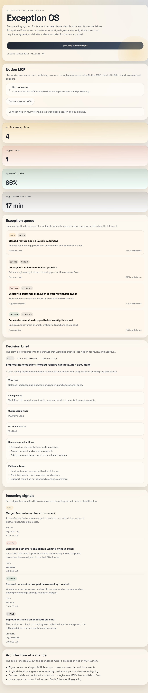
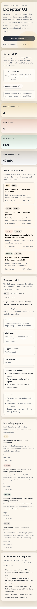

# Exception OS

Exception OS is a deployed SaaS-style operating system for teams that need fewer dashboards and faster decisions. It ingests live operational signals, detects exceptions that require human judgment, generates structured decision briefs, and routes them into a Notion-centered workflow.

[Live Demo](https://exception-os.vercel.app) · [GitHub Repository](https://github.com/aniruddhaadak80/exception-os) · [DEV Submission Draft](./docs/devto-submission.md)

## Status

Exception OS is complete as a deployable challenge app and SaaS-style product foundation.

- Production deployment is live on Vercel.
- The dashboard is responsive and verified on desktop and mobile layouts.
- Lint, tests, and production build are passing.
- Real Notion MCP OAuth, workspace sync, and Notion publishing are implemented server-side.
- Other users can use the deployed app by connecting their own Notion workspace.
- Live GitHub activity now feeds the dashboard without seeded incident templates.

The only runtime step that still depends on the user is approving Notion OAuth for a specific workspace, which cannot be done automatically on someone else’s behalf.

## What Is Real Today

- Multi-user deployment through the public Vercel app
- Per-user Notion OAuth connection flow
- Live Notion MCP workspace search
- Live publishing of decision briefs into the connected workspace
- Live GitHub repository ingestion for engineering, workflow, milestone, and documentation activity
- Production build, linting, tests, screenshots, and challenge documentation

This means the app is not a fake mockup. It is a real deployed product with a real Notion integration and a live GitHub-backed ingestion layer.

## Screenshots

### Desktop



### Mobile



This repository contains:

- A polished Next.js production deployment for the Exception OS dashboard
- A live-source engine for GitHub activity and connected Notion workspace context
- A real server-side Notion MCP integration for OAuth, workspace search, and publishing
- Product documentation for the feature spec and architecture
- A challenge-ready narrative aligned with the Notion MCP judging criteria

## Why this project fits the challenge

Most AI productivity tools summarize noise. Exception OS focuses on the smaller set of events that actually need executive attention. Notion MCP is the live system of record for workspace memory, decision publishing, and operator context.

## Local development

```bash
npm install
npm run dev
```

Then open `http://localhost:3000`.

## Notion MCP integration

This app now includes a real server-side Notion MCP adapter with OAuth, token refresh support, workspace search, and page publishing, plus live GitHub ingestion for repository-driven operational signals.

To enable it locally or on Vercel, configure:

- `EXCEPTION_OS_SESSION_SECRET`: long random string used to encrypt server-side session cookies

Optional:

- `NOTION_MCP_SERVER_URL`: defaults to `https://mcp.notion.com`
- `NOTION_PARENT_PAGE_ID`, `NOTION_PARENT_DATABASE_ID`, or `NOTION_PARENT_DATA_SOURCE_ID`: optional fixed Notion location for published decision briefs
- `EXCEPTION_OS_GITHUB_REPO`: GitHub repository to ingest live signals from, in `owner/repo` format
- `EXCEPTION_OS_GITHUB_TOKEN`: optional GitHub token for higher rate limits
- `NOTION_SUPPORT_QUERY`, `NOTION_REVENUE_QUERY`, `NOTION_CALENDAR_QUERY`, `NOTION_DOCS_QUERY`: optional workspace-specific search prompts for live Notion signal ingestion

Once configured, use the dashboard's `Connect Notion MCP` action to complete OAuth. If you do not set a fixed parent in environment variables, paste a Notion page URL into the dashboard and save it before publishing.

## Demo flow

1. View the live operations board.
2. Review the active exception queue sourced from GitHub and Notion.
3. Refresh the dashboard to pull the latest live signals.
4. Connect Notion MCP and publish the selected decision brief into your workspace.
5. Sync related workspace context back into the dashboard.

## Challenge submission

The prepared DEV submission is in [./docs/devto-submission.md](./docs/devto-submission.md). It already includes the real screenshots, live demo URL, and GitHub repo link.

## Project structure

- `src/app` app routes and API endpoints
- `src/components` UI components
- `src/lib` simulation engine and shared types
- `docs` feature spec and architecture documents

## Current implementation scope

This version runs as a polished challenge app out of the box and already includes a real Notion-connected workflow plus live GitHub ingestion. Notion read and write operations are live once connected, and the deployed app is usable by other users with their own Notion workspace.

## Judge-Facing Summary

If you are using this README to understand challenge readiness, the most accurate summary is:

- The app is fully deployed and usable.
- The Notion MCP integration is real and central to the product.
- The upstream signal layer is live for GitHub and live for connected Notion workspace search.
- The architecture is already structured for adding more source connectors as the next production increment.

## Quality checks

```bash
npm run lint
npm run test
npm run build
```